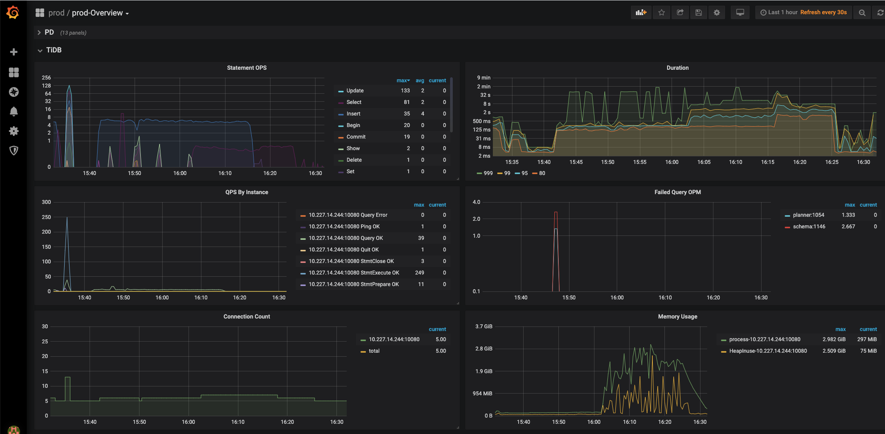
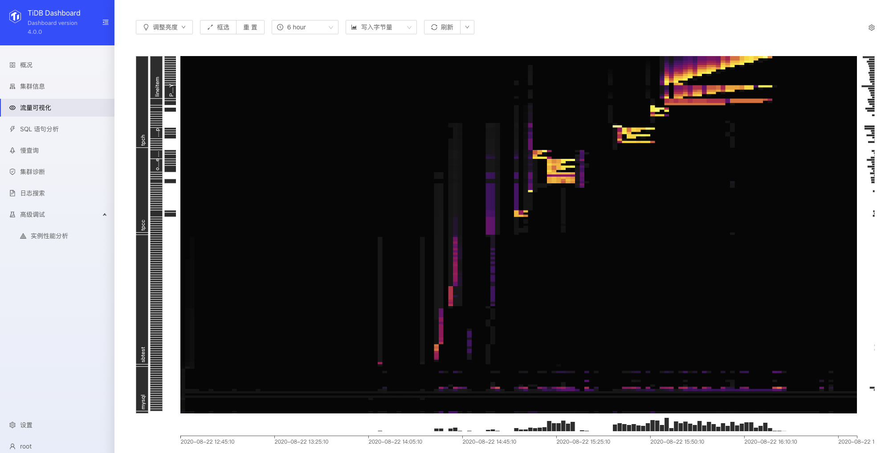
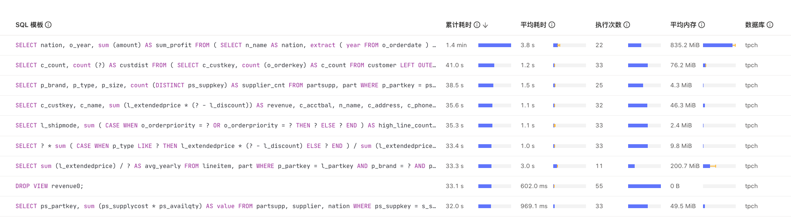
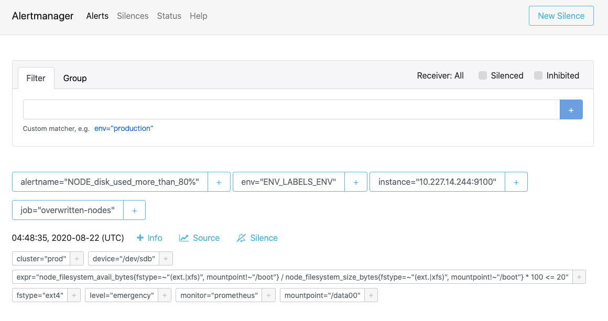

# 部署

## 物理机部署

下载 cluster 组件`tiup install cluster`，编辑/tmp/topology.yaml

```yaml
global:
  user: "wangxiaodong.gd"
  ssh_port: 22
  deploy_dir: "/tidb-deploy"
  data_dir: "/tidb-data"

pd_servers:
  - host: 10.227.14.244

tidb_servers:
  - host: 10.227.14.244

tikv_servers:
  - host: 10.227.14.244

monitoring_servers:
  - host: 10.227.14.244

grafana_servers:
  - host: 10.227.14.244

alertmanager_servers:
  - host: 10.227.14.244
```

部署

```shell
tiup cluster deploy prod v4.0.0  /tmp/topology.yaml -i /Users/wangxiaodong/.ssh/id_rsa -u wangxiaodong.gd
```

启动

```shell
tiup cluster start prod
```

## sysbench 测试

安装 sysbench ,通过 brew 安装`brew install sysbench`

### 数据准备

```mysql
create database sbtest;
set global tidb_disable_txn_auto_retry=off;

#改回来
#set global tidb_txn_mode="pessimistic"
```

```shell
sysbench oltp_update_non_index --config-file=config --threads=32 --tables=32 --table-size=10000 prepare
```

sysbench 配置文件

```text
mysql-host=10.227.14.244
mysql-port=4000
mysql-user=root
mysql-db=sbtest
report-interval=3
```

### Point select 测试

```shell
sysbench --config-file=config oltp_point_select --threads=32 --tables=32 --table-size=10000 run
```

### Update index 测试

```shell
sysbench --config-file=config oltp_update_index --threads=32 --tables=32 --table-size=10000 run
```

### Read-Only 测试

```shell
sysbench --config-file=config oltp_read_only --threads=32 --tables=32 --table-size=10000 run
```

## go-ycsb 测试

### 安装 go-ycsb

```shell
git clone https://github.com/pingcap/go-ycsb.git
cd go-ycsb && make
```

### load & run

workloada 负载测试

```shell
./bin/go-ycsb load mysql -P workloads/workloada -p recordcount=10000 -p mysql.host=10.227.14.244 -p mysql.port=4000 --threads 256

./bin/go-ycsb run mysql -P workloads/workloada -p recordcount=10000 -p mysql.host=10.227.14.244 -p mysql.port=4000 --threads 64

```

## go-tpc 测试

交易场景测试

### 安装 go-tpc

```bash
git clone https://github.com/pingcap/go-tpc.git
cd go-tpc
make build
```

### tpc-c

准备数据

```bash
./bin/go-tpc tpcc -H 10.227.14.244 -P 4000 -D tpcc --warehouses 10 prepare
```

运行测试

```bash
./bin/go-tpc tpcc -H 10.227.14.244 -P 4000 -D tpcc --warehouses 10 run --time 1m --threads 8
```

### tpc-h

准备数据

```bash
./bin/go-tpc tpch prepare -H 10.227.14.244 -P 4000 -D tpch --sf 4 --analyze
```

运行测试

```bash
./bin/go-tpc tpch run -H 10.227.14.244 -P 4000 -D tpch --sf 1
```

## 测试数据

[benchmark](benchmark.md)

## 部分截图








